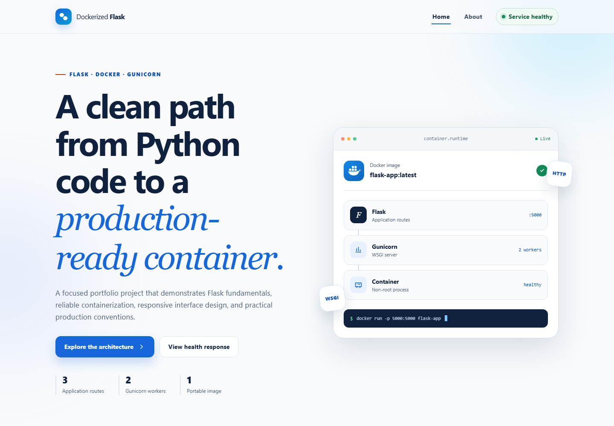
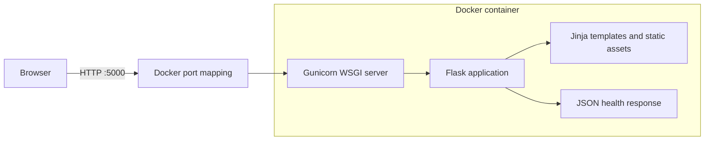

# Dockerized Flask Web Application

[](https://www.python.org/)
[](https://flask.palletsprojects.com/)
[](https://www.docker.com/)
[](https://github.com/zhargan-byte/dockerized-flask-app/releases/latest)
[](https://github.com/zhargan-byte/dockerized-flask-app/pkgs/container/dockerized-flask-app)
[](LICENSE)

A beginner-friendly, production-minded Flask portfolio project packaged as a portable Docker image. It combines clean Python routing, Jinja templates, a responsive interface, a JSON health endpoint, automated tests, Gunicorn, and container security practices in a codebase that is intentionally easy to inspect.



## Architecture



The host publishes port `5000` and forwards requests to Gunicorn inside the container. Gunicorn runs the Flask application with two workers and two threads per worker. Flask then returns either an HTML page or a JSON health response.

## Features

- Application-factory pattern for clean configuration and testing
- Home (`/`), About (`/about`), and Health (`/health`) routes
- Custom, user-friendly 404 response
- Responsive HTML/CSS interface with accessible navigation
- Subtle 3D card interaction and scroll reveals with reduced-motion support
- Live service-status indicator powered by the health endpoint
- Production WSGI serving with Gunicorn
- `python:3.13-slim` base image and pinned Python dependencies
- Non-root container process and built-in Docker health check
- Baseline browser security headers
- Automated route, response, and header tests

## Project structure

```text
dockerized-flask-app/
├── app.py
├── requirements.txt
├── Dockerfile
├── .dockerignore
├── .gitignore
├── LICENSE
├── README.md
├── screenshots/
│   └── application-home.png
├── static/
│   ├── css/
│   │   └── style.css
│   └── js/
│       └── script.js
├── templates/
│   ├── base.html
│   ├── index.html
│   ├── about.html
│   └── 404.html
└── tests/
    └── test_app.py
```

## Prerequisites

Choose either a local Python workflow or Docker.

- [Git](https://git-scm.com/downloads) for cloning the repository
- [Python 3.13](https://www.python.org/downloads/) for local execution
- [Docker Desktop](https://www.docker.com/products/docker-desktop/) for container execution on Windows or macOS
- Docker Engine on Linux

Verify the tools that you plan to use:

```bash
git --version
python --version
docker --version
```

On Windows, the Python launcher may be available as `py` instead of `python`:

```powershell
py --version
```

## Get the project

Clone the repository and enter its directory:

```bash
git clone https://github.com/zhargan-byte/dockerized-flask-app.git
cd dockerized-flask-app
```

Alternatively, open the repository in GitHub, select **Code**, choose **Download ZIP**, extract the archive, and open a terminal in the extracted `dockerized-flask-app` folder.

## Option 1: run locally with Python

### 1. Create a virtual environment

Windows PowerShell:

```powershell
python -m venv .venv
.venv\Scripts\Activate.ps1
```

macOS or Linux:

```bash
python3 -m venv .venv
source .venv/bin/activate
```

### 2. Install dependencies

```bash
python -m pip install --upgrade pip
python -m pip install -r requirements.txt
```

### 3. Start the development server

```bash
python app.py
```

Open [http://localhost:5000](http://localhost:5000). Stop the server with `Ctrl+C`.

> Flask's built-in server is convenient for local development. The Docker image uses Gunicorn for a production-style runtime.

## Option 2: build and run with Docker

### Use the published image

The versioned image is available from the [GitHub Container Registry package](https://github.com/zhargan-byte/dockerized-flask-app/pkgs/container/dockerized-flask-app):

```bash
docker pull ghcr.io/zhargan-byte/dockerized-flask-app:v1.0.0
docker run -d -p 5000:5000 --name flask-app ghcr.io/zhargan-byte/dockerized-flask-app:v1.0.0
```

The remaining steps explain how to build the same image directly from the source code.

### 1. Start Docker

Open Docker Desktop and wait until it reports that the engine is running. Linux users can check the Docker service with `sudo systemctl status docker`.

### 2. Build the image

Run this command from the directory containing the `Dockerfile`:

```bash
docker build -t flask-app .
```

- `docker build` creates an image from the Dockerfile.
- `-t flask-app` assigns the readable image name `flask-app`.
- `.` sends the current directory as the build context.

### 3. Confirm the image exists

```bash
docker images flask-app
```

### 4. Run the container

```bash
docker run -d -p 5000:5000 --name flask-app flask-app
```

- `docker run` creates and starts a container from the image.
- `-d` runs it in the background.
- `-p 5000:5000` maps host port `5000` to container port `5000`.
- `--name flask-app` gives the container a memorable name.
- The final `flask-app` identifies the image to run.

### 5. Verify the running container

```bash
docker ps
```

The `STATUS` column will first show `health: starting` and then `healthy` after the Docker health check succeeds.

### 6. Inspect application logs

```bash
docker logs flask-app
```

Use `-f` to follow new log entries:

```bash
docker logs -f flask-app
```

Press `Ctrl+C` to stop following logs; the container continues running.

### 7. Test every route

Open these URLs in a browser:

| Route | Purpose | Expected result |
| --- | --- | --- |
| `http://localhost:5000/` | Home page | HTTP `200` and responsive project UI |
| `http://localhost:5000/about` | About page | HTTP `200` and architecture explanation |
| `http://localhost:5000/health` | Health check | HTTP `200` and JSON with `"status": "healthy"` |
| `http://localhost:5000/not-found` | Missing route test | HTTP `404` and the custom error page |

Command-line test examples:

```bash
curl -i http://localhost:5000/
curl -i http://localhost:5000/about
curl -i http://localhost:5000/health
curl -i http://localhost:5000/not-found
```

PowerShell users can request and parse the health response with:

```powershell
Invoke-RestMethod http://localhost:5000/health
```

Expected health fields:

```json
{
  "service": "dockerized-flask-app",
  "status": "healthy",
  "timestamp": "2026-09-12T12:00:00+00:00"
}
```

The timestamp is generated at request time, so its value will differ.

### 8. Stop and remove the container

```bash
docker stop flask-app
docker rm flask-app
```

The image remains available for another container. Remove it separately only when it is no longer needed:

```bash
docker rmi flask-app
```

## Run the automated tests

Install the dependencies in a virtual environment, then run:

```bash
python -m unittest discover -s tests -v
```

The test suite validates the three public routes, JSON health contract, custom 404 page, and security headers.

## How the important files work

### `app.py`: Flask application, section by section

| Code area | Responsibility | Why it matters |
| --- | --- | --- |
| Imports | Loads time, environment, Flask, JSON, and template helpers | Keeps dependencies explicit and easy to audit |
| `create_app()` | Creates a new Flask instance and optionally applies test configuration | The factory pattern improves test isolation and future configuration management |
| `home()` | Renders `index.html` for `/` | Separates Python request handling from presentation markup |
| `about()` | Renders `about.html` for `/about` | Gives the portfolio project a human-readable technical explanation |
| `health()` | Returns status, service name, and UTC time as JSON | Docker and monitoring tools need a lightweight machine-readable endpoint |
| `page_not_found()` | Handles all unmatched URLs | Replaces Flask's generic error page with a consistent experience |
| `add_security_headers()` | Adds `nosniff`, frame, and referrer protections | Provides sensible browser defaults without changing route logic |
| `app = create_app()` | Exposes the WSGI application object | Gunicorn imports this as `app:app` |
| `app.run(...)` | Starts the local development server when the file is executed directly | Makes the project beginner-friendly while keeping production startup separate |

### Why Flask binds to `0.0.0.0`

`127.0.0.1` means “only this machine.” Inside Docker, that would mean only processes inside the same container could reach Flask. Binding to `0.0.0.0` listens on every container network interface, allowing Docker's published-port mapping to forward traffic from the host. It does **not** publish a port by itself; `docker run -p` controls publication.

### `Dockerfile`: each instruction explained

| Instruction | Purpose and rationale |
| --- | --- |
| `FROM python:3.13-slim` | Uses the requested Python 3.13 runtime without the larger build tools and operating-system packages included in full images |
| `ENV ...` | Avoids bytecode files, sends logs directly to Docker, and documents the application port |
| `WORKDIR /app` | Establishes a predictable directory for every following instruction and runtime command |
| `RUN groupadd ... useradd ...` | Creates an unprivileged account so the web process does not run as root |
| `COPY requirements.txt .` | Copies dependencies before source code so Docker can reuse the installation layer when only application files change |
| `RUN pip install ...` | Installs pinned packages without retaining pip's download cache |
| `COPY --chown ...` | Copies only runtime files and assigns them to the unprivileged account |
| `USER appuser` | Switches the remaining build and runtime context away from root |
| `EXPOSE 5000` | Documents the port expected by the application; publication still requires `-p` |
| `HEALTHCHECK ...` | Requests `/health` inside the container and marks repeated failures as unhealthy |
| `CMD ["gunicorn", ...]` | Starts two Gunicorn workers with two threads each and imports the Flask object from `app.py` |

### Why `python:3.13-slim`

The slim image keeps the official Python runtime and Debian compatibility while omitting many packages that this application does not need. That produces a smaller attack surface and faster image transfer than the full Python image. The tradeoff is that packages requiring native compilation may need extra build dependencies; this project's dependencies install as wheels and do not require them.

### `index.html`: layout and interaction

`index.html` extends `base.html`, which owns shared navigation, metadata, asset links, and the footer. The page then defines four semantic content areas:

1. A hero that communicates the project value and displays a container runtime card.
2. Three feature cards that summarize the Flask, Docker, and frontend decisions.
3. A request-lifecycle diagram showing browser → Gunicorn/Flask → response.
4. A call to action linked to the live health endpoint.

The styling lives in `static/css/style.css`, keeping the HTML readable. The runtime card uses CSS `perspective` on its parent and `rotateX()`/`rotateY()` transforms on the card. JavaScript computes a limited tilt from pointer position; it resets when the pointer leaves. This creates depth without a distracting continuous rotation.

Glass-morphism is limited to the navigation and runtime panel: translucent backgrounds, a visible border, gentle shadow, and `backdrop-filter` create layered depth. Text remains on sufficiently opaque surfaces for readability. When the operating system requests reduced motion, animations and the pointer tilt are disabled and content is shown in its final state.

## Production considerations

This project demonstrates production-minded conventions, but a real public deployment should also consider:

- Terminate HTTPS at a managed load balancer or reverse proxy.
- Put container image builds and tests in a CI/CD pipeline.
- Set worker counts from measured CPU and traffic instead of fixed demonstration values.
- Send structured logs to a centralized logging service.
- Add metrics, tracing, alerting, and an orchestration-level readiness check.
- Store secrets in a secrets manager—not in source control or Docker build arguments.
- Pin the Docker base image by digest and use automated vulnerability scanning.
- Add a content security policy tailored to the deployment environment.

## Troubleshooting

| Problem | Likely cause | Resolution |
| --- | --- | --- |
| `docker: command not found` | Docker is not installed or is missing from `PATH` | Install Docker Desktop/Engine, restart the terminal, and run `docker --version` |
| Cannot connect to the Docker daemon | Docker Desktop or the Linux Docker service is stopped | Start Docker Desktop or run `sudo systemctl start docker` |
| `port is already allocated` | Another process or container uses port `5000` | Stop that process, or run `docker run -d -p 8000:5000 --name flask-app flask-app` and browse to port `8000` |
| Container name is already in use | An older container is still named `flask-app` | Run `docker rm -f flask-app` only if that old container is no longer needed, then retry |
| Container exits immediately | Startup or dependency error | Run `docker logs flask-app` and inspect the first traceback or Gunicorn error |
| Health remains `starting` or becomes `unhealthy` | The app is not answering `/health` inside the container | Run `docker inspect flask-app` and `docker logs flask-app`; confirm the image was rebuilt after code changes |
| Browser shows an old page | A previous image layer or browser cache is being used | Rebuild with `docker build --no-cache -t flask-app .`, recreate the container, and hard-refresh the browser |
| PowerShell blocks virtual-environment activation | Script execution policy prevents `Activate.ps1` | Run the environment's Python directly: `.venv\Scripts\python.exe app.py` |

## Suggested commit history

A clear public history could use these focused commits:

1. `chore: scaffold Flask project structure`
2. `feat: add application routes and health endpoint`
3. `feat: build responsive portfolio interface`
4. `build: add production Docker image with Gunicorn`
5. `test: cover routes errors and security headers`
6. `docs: add setup architecture and troubleshooting guide`

## Future enhancements

- Add PostgreSQL with SQLAlchemy and database migrations
- Add user authentication with secure session handling
- Add Docker Compose for application and database services
- Add Nginx as a reverse proxy and TLS termination layer
- Add GitHub Actions for tests, linting, and image builds
- Add signed image provenance and an automated vulnerability scan
- Deploy to a managed container platform with autoscaling
- Add OpenTelemetry tracing and Prometheus metrics

## License

This project is available under the [MIT License](LICENSE). The MIT license permits reuse, modification, and distribution provided the copyright and permission notice are retained. It does not provide a warranty, and it does not grant trademark rights.
